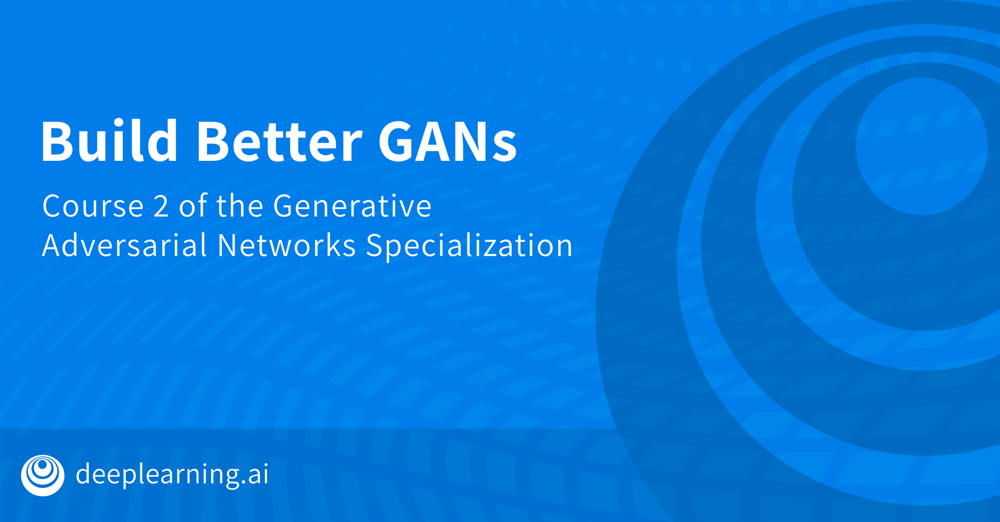

# Build Better Generative Adversarial Networks
##### <b><u> Course topics are:</u></b>
* GAN evaluation (Inception-score, FID, Sampling and Truncation, Precision and Recall)
* GAN Disadvantages and Bias
* Style-GAN
